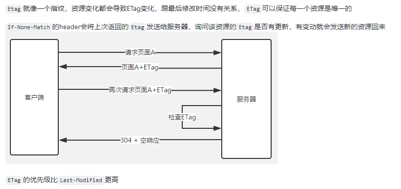

## 前端缓存

分为三大类

- 数据库缓存
- 服务器缓存
    - 代理服务器缓存
    - CDN缓存
- 浏览器(客户端)缓存
    - HTTP header缓存机制
        - 强缓存：Expires, Cache-Control
        - 协商缓存
            - Last-Modified, if-Modified-Since
            - ETag(文件唯一标识、指纹)，if-None-Match
            - http状态码 304 
    - 数据缓存
        - cookie
        - web storage
        - indexDB
        - Web SQL
    - PWA、离线应用缓存
        - Service Worker、Web App Manifest
---

### 浏览器缓存
[浏览器缓存机制](https://github.com/amandakelake/blog/issues/41)
- 强缓存

> Expires http1.0提供的资源过期时间。本地时间修改可能造成缓存不可用

> Cache-Control: no-cache 实际上是可以存储在本地缓存区中的，只是在与原始服务器验证前，缓存不会提供给客户端使用
> Cache-Control: no-store才是真正的不缓存数据到本地
> Cache-Control: public可以被所有用户缓存（多用户共享），包括终端和CDN等中间代理服务器
> Cache-Control: private只能被终端浏览器缓存（而且是私有缓存），不允许中继缓存服务器进行缓存

- 协商缓存
    - Last-Modified, if-Modified-Since: 如果在本地打开缓存文件，就会造成 Last-Modified 被修改，所以在 HTTP / 1.1 出现了 ETag
    - ETag、If-None-Match

流程图：

--- 
###### 几种状态码的区别
- 200：强缓Expires/Cache-Control存失效时，返回新的资源文件
- 200(from cache): 强缓Expires/Cache-Control两者都存在，未过期，Cache-Control优先Expires时，浏览器从本地获取资源成功
- 304(Not Modified )：协商缓存Last-modified/Etag没有过期时，服务端返回状态码304

> 但是！但是！
现在的200(from cache)已经变成了from disk cache(磁盘缓存)和from memory cache(内存缓存)两种

###### 如何选择合适的缓存
大致的顺序

- Cache-Control —— 请求服务器之前
- Expires —— 请求服务器之前
- If-None-Match (Etag) —— 请求服务器
- If-Modified-Since (Last-Modified) —— 请求服务器

==协商缓存需要配合强缓存使用，如果不启用强缓存的话，协商缓存根本没有意义==

大部分web服务器都默认开启协商缓存，而且是同时启用【Last-Modified，If-Modified-Since】和【ETag、If-None-Match】

但是下面的场景需要注意：

- 分布式系统里多台机器间文件的Last-Modified必须保持一致，以免负载均衡到不同机器导致比对失败；
- 分布式系统尽量关闭掉ETag(每台机器生成的ETag都会不一样）；

---
其他参考：
[浏览器的缓存机制 && 304过程](https://juejin.cn/post/7067807713702936607)

##### 304过程

- 浏览器请求资源时首先命中资源的Expires 和 Cache-Control，Expires 受限于本地时间，如果修改了本地时间，可能会造成缓存失效，可以通过Cache-control: max-age指定最大生命周期，状态仍然返回200，但不会请求数据，在浏览器中能明显看到from cache字样。

- ==强缓存失效，进入协商缓存阶段==，首先验证ETagETag可以保证每一个资源是唯一的，资源变化都会导致ETag变化。服务器根据客户端上送的If-None-Match值来判断是否命中缓存。

- 协商缓存Last-Modify/If-Modify-Since阶段，客户端第一次请求资源时，服务服返回的header中会加上Last-Modify，Last-modify是一个时间标识该资源的最后修改时间。再次请求该资源时，request的请求头中会包含If-Modify-Since，该值为缓存之前返回的Last-Modify。服务器收到If-Modify-Since后，根据资源的最后修改时间判断是否命中缓存。
