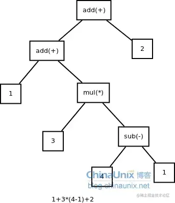
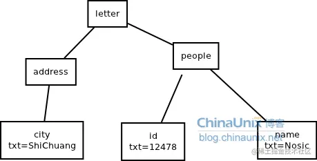

## `AST`抽象语法树

> 是源代码的抽象语法结构的树状表示，树上的每个节点都表示源代码中的一种结构，这所以说是抽象的

很多编译器经常要`独立地构造语法分析树`，为前端，后端建立一个清晰的接口。 抽象语法树在很多领域有广泛的应用，比如浏览器，智能编辑器，编译器。

[线上抽象语法树结构演示](https://astexplorer.net/)

实例：
- 运算
    ```js
    表达式: 1+3*(4-1)+2
    ```
    

- xml/html
    ```xml
    <letter>
    <address>
        <city>ShiChuang</city>
    </address>
    <people>
        <id>12478</id>
        <name>Nosic</name>
    </people>
    </letter>
    ```
    

- 程序
    ```java
    while b != 0 {
        if a > b
            a = a-b
        else
            b = b-a
    }
    return a
    ```
##### 文本 -> 抽象语法树的过程
1、词法分析：文本 -> token列表
  - 去除空格，对token分类，去除空格，然后对token分类，那些属于语法关键字，那些属于操作符，那些属于语句的截止位置，那些属于数据


2、语法分析：token列表 -> 语法二叉树
  - 扫描token流，然后分析它的语法，这一步应该是分析一条以;结尾的语句具体的执行规则，然后使用逆波兰表达式组合，最后形成一个二叉树，二叉树从底部往上一步步合并